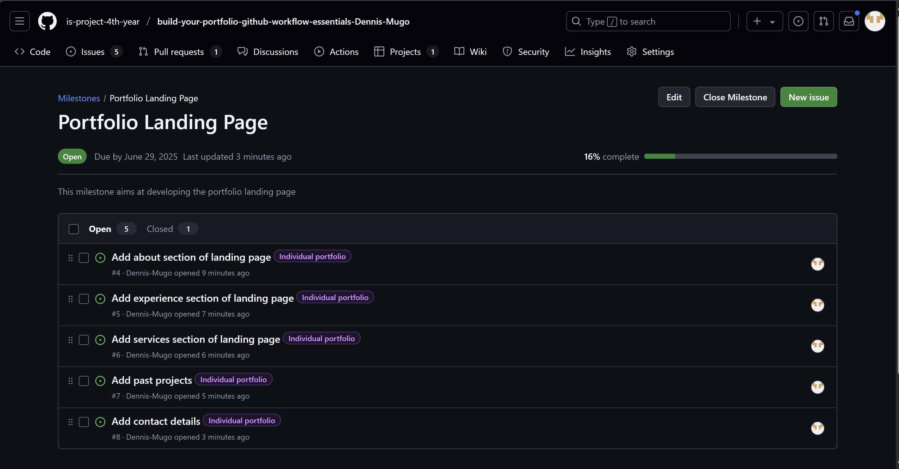
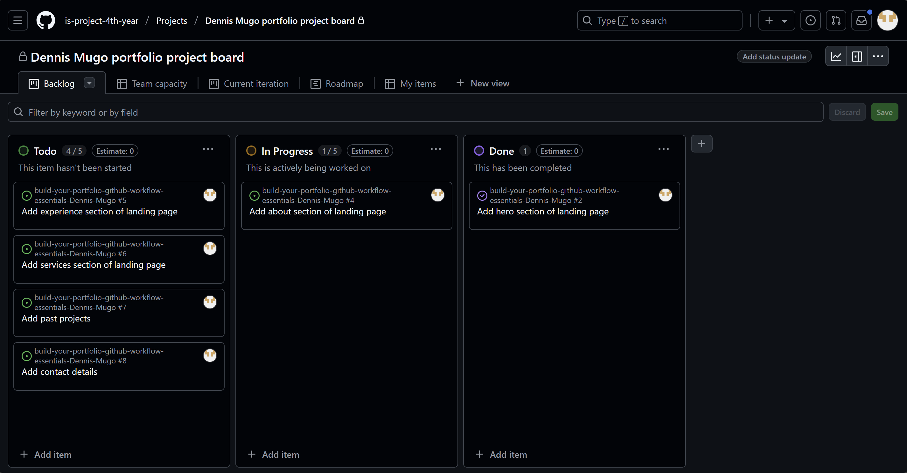
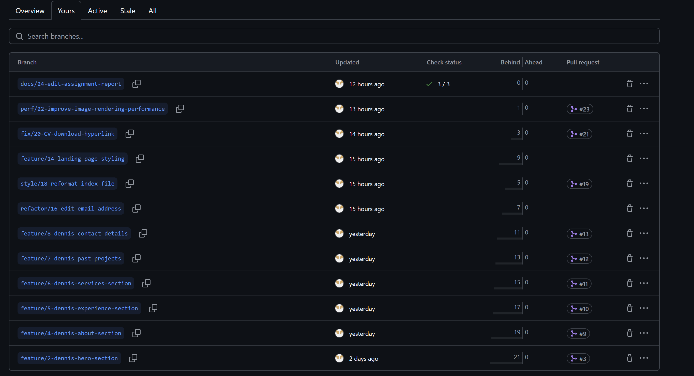
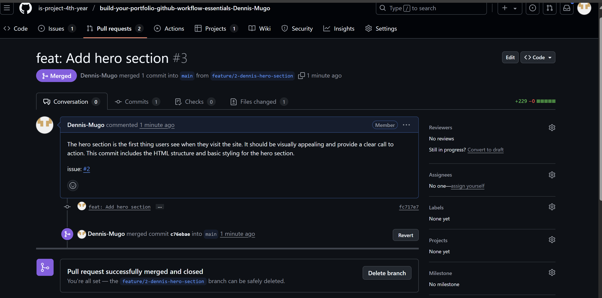
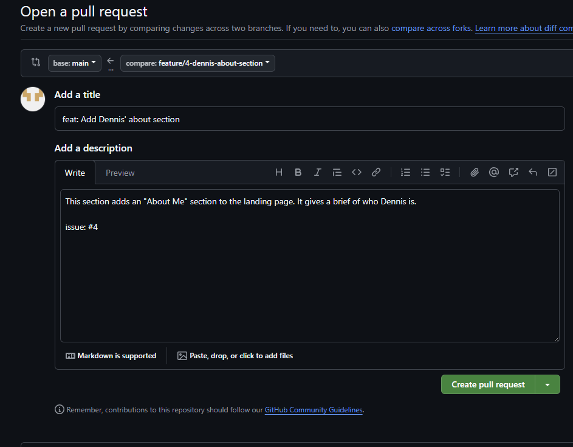
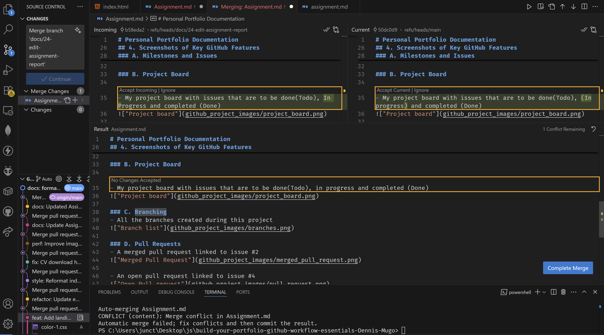
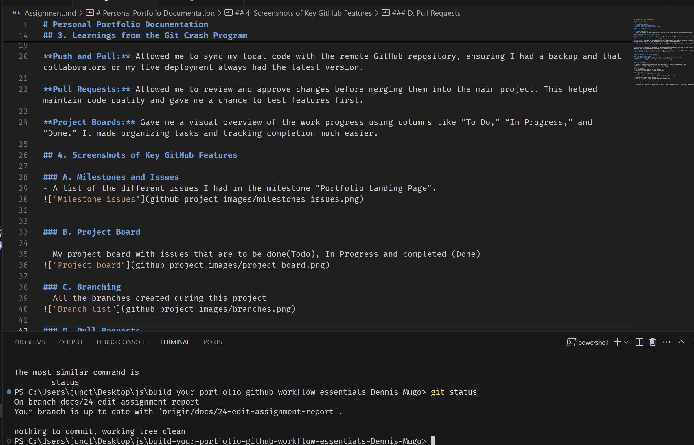

# Personal Portfolio Documentation

## 1. Student Details

- **Denns Mugo Thairu**
- **Github username: @Dennis-Mugo**
- **Guthub email: dennismugo2003@gmail.com**

## 2. Deployed Portfolio Link

- **GitHub Pages URL**:  
  https://is-project-4th-year.github.io/build-your-portfolio-github-workflow-essentials-Dennis-Mugo/

## 3. Learnings from the Git Crash Program

List at least **four key concepts or skills** you learned during the Git crash course. For each one, write a brief explanation of how it helped you manage your portfolio project more effectively.

**Committing:** Enabled me to track each significant change I made, like updating content or fixing layout issues. This created a clear timeline of edits and made it easy to revert if something broke.

**Push and Pull:** Allowed me to sync my local code with the remote GitHub repository, ensuring I had a backup and that collaborators or my live deployment always had the latest version.

**Pull Requests:** Allowed me to review and approve changes before merging them into the main project. This helped maintain code quality and gave me a chance to test features first.

**Project Boards:** Gave me a visual overview of the work progress using columns like “To Do,” “In Progress,” and “Done.” It made organizing tasks and tracking completion much easier.

## 4. Screenshots of Key GitHub Features

### A. Milestones and Issues
- A list of the different issues I had in the milestone "Portfolio Landing Page".

### B. Project Board

- My project board with issues that are to be done(Todo), (In progress) and completed (Done)

### C. Branching
- All the branches created during this project

### D. Pull Requests
- A merged pull request linked to issue #2

- An open pull request linked to issue #4

### E. Merge Conflict Resolution

- A merge conflict occurence

- Resolving the merge conflict by accepting the current change (on the left)

- Resolved merge conflict

